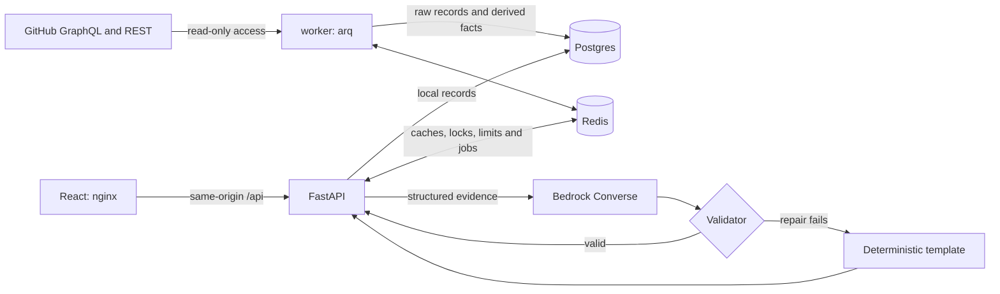

# Delivery Insights

Delivery Insights helps engineering managers and directors see where PRs wait and what evidence supports an explanation. `GET /v1/insights/delivery` returns deterministic metrics and bottlenecks; `GET /v1/snapshots/{snapshot_id}/narrative` explains the same snapshot. The API supports English or Chinese prose, hypotheses and evidence chains. The dashboard uses English.

All sections select PRs opened **or with recorded human activity** during the selected UTC period; comparisons apply the same rule to the previous period.
Known human comments/reviews/state/label actions qualify; bot/unknown actors, CI and `updatedAt` alone do not. Commit actors are currently unavailable.
Historical baselines and lifecycle durations keep their meaning. Risk lists start with five rows and offer **Load more**; there is no dashboard language selector.

The implementation covers P0 and P1 in [the implementation plan](docs/plan/00-overview.md).
Automated checks, real Bedrock evaluation and 30-day GitHub acceptance pass. The user limited
live backfill to 30 days; 90/180-day checks and human signoff are excluded. See [acceptance evidence](docs/ACCEPTANCE.md).

## Quickstart (60 seconds)

Prerequisites: Docker with Compose v2. To collect live data, create a GitHub fine-grained
personal access token with **Repository access: Public repositories**, without extra
repository permissions. The commands below are for a POSIX shell.
Image builds and initial backfill take longer than the setup steps.

```bash
[ -f .env ] || cp .env.example .env
# Edit .env: set GITHUB_TOKEN; optionally set AWS_BEARER_TOKEN_BEDROCK.
docker compose up --build -d
docker compose ps -a
```

Open [the dashboard](http://localhost:5173) or [the API docs](http://localhost:8000/docs).
On PowerShell, use `if (!(Test-Path .env)) { Copy-Item .env.example .env }`; keep existing credentials.
The API and UI bind to loopback. Postgres and Redis have no published host ports.

The worker backfills `dotnet/runtime` in 7-, 30- and 180-day stages by default.
Until a requested period is covered, the API returns `202` with `Retry-After` and the UI
shows progress. For the verified 30-day demo, set `BACKFILL_DAYS=30` and `PRECOMPUTE_DAYS=7,30`.

```bash
API=http://localhost:8000
TO=$(python3 -c 'import datetime as d; print(d.datetime.now(d.timezone.utc).date())')
FROM=$(python3 -c 'import datetime as d; print(d.datetime.now(d.timezone.utc).date()-d.timedelta(days=6))')
curl -s "$API/v1/insights/delivery?repo=dotnet/runtime&from=$FROM&to=$TO"
```

Without the Bedrock key, narratives use a deterministic template:
`meta.generated_by="template"`, `meta.fallback_reason="llm_disabled"`.
Without a GitHub token, the service still starts: `/v1/repos` reports `missing_token`
and insights return `503 data-unavailable` until local data is available.

## The insight and why this metric

The core metric is **PR cycle time and where it waits**: first commit to merge,
split into coding, reviewer wait, author wait, observed CI wait and merge wait.
Each report combines team outcomes with bottleneck analysis and the previous period.
The headline connects the outcome, the largest bottleneck and an illustrative action.

| View | Question | Decision it supports |
|---|---|---|
| Cycle median and p90 | Is delivery slower, including the tail? | Investigate a change in the process |
| Waiting share | How much of the whole cycle is waiting? | Separate active work from handoffs |
| Time ledger | Who or what is the post-ready wait for? | Review capacity, CI or merge policy |
| Location and queue | Where is demand exceeding capacity? | Add area reviewers or improve assignment |
| Reverts and waste | Is apparent speed buying quality risk? | Review guardrails beside cycle time |
| At-risk PRs | Which open changes exceed historical waits? | Triage concrete work |

Waiting share uses coding plus active post-ready time as its denominator.
The time ledger uses only post-ready waiting states; its shares have a different denominator.
These are PR-flow signals, not deployment lead time, DORA change failure rate,
individual productivity scores or causal proof. Workflow and timestamp changes affect them.

## How it works



1. **Sync:** staged backfill, overlapping incremental windows and open-PR sweeps write
   idempotent batches. Checkpoints advance only after successful phase completion.
2. **Derive:** a causal state machine creates non-overlapping intervals and per-PR facts.
   Reverts, relands and superseded PRs are linked; ownership changes trigger rederivation.
3. **Snapshot:** one repeatable-read database view feeds pure analytics, deterministic
   bootstrap comparisons and canonical JSON. Parameters, versions and watermarks set identity.
4. **Narrative:** code selects evidence and scores hypotheses. Bedrock supplies wording;
   code validates it, repairs once if necessary, then falls back to a checked template.

| Component | Responsibility |
|---|---|
| `api` | Local-data queries, snapshot/narrative persistence, manual sync enqueueing |
| `worker` | GitHub ingestion, derivation, enrichment, precomputation, retention |
| `postgres` | Source data, facts, intervals, immutable snapshots and narratives |
| `redis` | arq jobs, locks, response caches and fixed-window limits |
| `web` | React dashboard and nginx same-origin proxy |
| `migrate` | One-shot Alembic schema upgrade before API/worker startup |

Analytics has no database or HTTP imports. The I/O loader lives in `db/dataset.py`.
The API process does not import source adapters or call GitHub on requests.
It may call Bedrock for an uncached narrative; heavy analytics and boto3 run in threads.

## API

OpenAPI is available at `/openapi.json` and `/docs`; the full contract is
[06-api.md](docs/plan/06-api.md). Dates and timestamps use UTC.
`from` and `to` are inclusive dates; comparison uses the preceding equal-length period.
`as_of` is capped by the least recent repository sync watermark.

| Method | Path | Purpose |
|---|---|---|
| GET | `/v1/insights/delivery` | Insight snapshot for selected repositories and dates |
| GET | `/v1/insights/delivery/prs` | Filtered and paginated PR detail |
| GET | `/v1/snapshots/{snapshot_id}` | Read a retained immutable snapshot |
| GET | `/v1/snapshots/{snapshot_id}/narrative` | `audience=director\|manager`, `lang=en\|zh` |
| GET | `/v1/repos` | Whitelist, freshness and sync status |
| POST | `/v1/repos/{owner}/{name}/sync` | Enqueue a manual sync |
| GET | `/v1/sync-jobs/{job_id}` | Inspect sync progress |
| GET | `/healthz` | Process liveness |
| GET | `/readyz` | Postgres and Redis readiness |

Repeated `repo=` values aggregate tracked repositories; `org=` selects only tracked
repositories of that owner. Percentiles pool PRs; `per_repo` preserves separate views.
Unknown parameters are rejected. Invalid input returns `422`; untracked repos return `403`.
Errors use RFC 9457 `application/problem+json` with `request_id` and sanitized detail.

Once sync has produced a `200` response, these examples reuse the Quickstart variables:

```bash
curl -sD /tmp/di-headers "$API/v1/insights/delivery?repo=dotnet/runtime&from=$FROM&to=$TO" -o /tmp/di-snapshot.json
SID=$(python3 -c 'import json; print(json.load(open("/tmp/di-snapshot.json"))["snapshot_id"])')
ETAG=$(python3 -c 'from pathlib import Path; print(next(s.split(":",1)[1].strip() for s in Path("/tmp/di-headers").read_text().splitlines() if s.lower().startswith("etag:")))')
curl -i -H "If-None-Match: $ETAG" "$API/v1/insights/delivery?repo=dotnet/runtime&from=$FROM&to=$TO"
curl -s "$API/v1/snapshots/$SID"
curl -s "$API/v1/snapshots/$SID/narrative?audience=manager&lang=zh"
```

The conditional request returns `304` with no body. Insights have a 60-second private
HTTP cache; snapshots by ID have a one-day immutable cache. Successful narratives and
disabled-LLM templates have `private, max-age=3600`; failure fallbacks use `no-store`.
Internal Redis TTLs are separate from HTTP cache directives.

A `202` is a Pending object, not a snapshot. Respect `Retry-After`; inspect each repo's
`reason` and `job`. The UI polls for at most five minutes, then asks for a later refresh.
PR pages accept `status`, `at_risk`, `state`, `location`, `limit` and `cursor`.
A cursor is tied to snapshot identity and filters; refresh if the data version changes.

## Narrative, confidence and evidence chain

Confidence is a **deterministic evidence-strength score**, not a probability.
It has not been calibrated against real repository outcomes or hand-labeled causes.
Correlations, queue pressure and what-if estimates are reasons to investigate, not proof.

The model sees structured numbers, evidence IDs and sanitized repository/location names.
It never sees PR titles, bodies, comments or user names. Code supplies evidence references,
sample counts, changes, guardrails and eligible hypotheses from this library:

| Hypothesis | Symptom | Mechanism to look for |
|---|---|---|
| Review capacity | More time waiting for review | Demand, concentration and localized first-review delay |
| CI bottleneck | More observed CI waiting | Queue/runtime increases or flaky reruns |
| PR size growth | Longer cycle or author/review stages | Larger changes with extra review/rework |
| Quality trade-off | Faster cycle | Reverts or unusually fast approval of large changes |

```text
score = 0.30*S + 0.20*E + 0.20*P + 0.15*N + 0.15*L - 0.15*C
```

| Factor | Meaning |
|---|---|
| S | Fraction of evaluable symptom/mechanism signals present |
| E | Direction-aware effect size against previous weekly variability |
| P | Fraction of current weeks supporting the change |
| N | `min(1, main_metric_sample_size / 100)` |
| L | Localization/concentration, defined for each hypothesis |
| C | Number of counter-evidence groups present |

Example covered by tests: S=4/5, E=1, P=10/13, N=61/100, L=0.63, C=0
gives 0.7798, rounded to **0.78 (high)**. One counter-evidence group yields **0.63 (medium)**.
No mechanism signal means no hypothesis, even when symptoms look strong.
CI confidence is capped at 0.50 unless CI is available, coverage is at least 0.50,
and `CI_COMPLETE=true`. The default is false because Actions may be only partial CI.

| Score after caps and rounding | Level | Wording |
|---|---|---|
| At least 0.75 | high | likely |
| Greater than 0.50, below 0.75 | medium | may / might / possibly / could |
| 0.35 through 0.50 | low | early signs |
| Below 0.35, missing comparison or mechanism | abstain | insufficient support |

Validators check schema, IDs, sentence-local numeric grounding, units, direction,
citation coverage, personal identifiers and causal wording ceilings across the whole body.
An LLM may downgrade a candidate, never raise its deterministic score or wording level.
At most one outside-library hypothesis is allowed and fixed at low confidence (0.35).
Invalid output is repaired once using the previous output and exact validation failures.
Timeouts, errors or a second invalid answer return a deterministic template.
Inspect `meta.generated_by`, `validation`, `attempts`, `fallback_reason` and `violations`.
In the UI, citation buttons scroll to and highlight the corresponding evidence entry.

## Configuration

Copy `.env.example`; never commit `.env`. Full environment defaults are in `backend/src/insights/config.py`.

| Variable | Default | Purpose |
|---|---|---|
| `GITHUB_TOKEN` | empty | GitHub collection; missing token is reported explicitly |
| `AWS_BEARER_TOKEN_BEDROCK` | empty | Optional Bedrock API key; empty enables templates |
| `AWS_REGION` | `us-west-2` | Bedrock client region |
| `BEDROCK_MODEL_ID` | `us.anthropic.claude-sonnet-4-6` | Converse model/inference profile |
| `TRACKED_REPOS` | `dotnet/runtime` | Comma-separated repository allowlist |
| `LOCATION_DIMENSION` | `label:area-` | Label, CODEOWNERS or directory grouping |
| `BACKFILL_DAYS` | `180` | Final backfill stage, between 30 and 365 |
| `SYNC_INTERVAL_MINUTES` | `15` | Incremental cadence; must divide 60 |
| `CI_SOURCE` | `actions` | `actions` or `none` |
| `CI_COMPLETE` | `false` | Assert complete CI only when justified by the repository |
| `CORS_ORIGINS` | `http://localhost:5173` | Comma-separated allowed browser origins |
| `RATE_LIMIT_PER_MINUTE` | `120` | Per-client-IP fixed-window limit on `/v1` |
| `DATABASE_URL` | Compose Postgres URL | Async SQLAlchemy database connection |
| `REDIS_URL` | `redis://redis:6379/0` | Cache, job queue and locks |

Create the GitHub token under Settings → Developer settings → Personal access tokens
→ Fine-grained tokens. Choose Public repositories, an expiration and no extra permissions.
The current implementation targets public repositories; private-repo authorization is not verified.
Model availability and Bedrock access/billing must be verified in your AWS account.
Set `CI_COMPLETE=true` only if Actions telemetry covers the CI you intend to measure.

## Operations

Use `/healthz` for liveness and `/readyz` for dependency readiness. Read `/v1/repos`
before judging missing data. Snapshots/narratives are retained for seven days and sync-job
records for thirty days; source PR records are retained until the database is reset.
Worker housekeeping expires retained data and precomputes 7-, 30- and 90-day reports.

```bash
curl -s http://localhost:8000/readyz
curl -s http://localhost:8000/v1/repos
curl -i -X POST http://localhost:8000/v1/repos/dotnet/runtime/sync
docker compose logs --tail=50 api worker
```

Manual sync responds `202` with `Location`; repeating it during the 300-second cooldown
returns `429` with `Retry-After`. General rate limiting also returns `429`.
Requests proxied through nginx share its upstream client-IP bucket; this is a local demo.
Cache/rate-limit Redis failures are fail-open where possible; readiness still reports failure.
Worker locks are renewed; checkpoints support resumption. Compose restarts failed workers.

Access logs are JSON with `request_id`, `method`, `path`, `status` and `duration_ms`.
Worker application events include `job`, `repo` and `phase`; CLI bootstrap logs are JSON too.
Snapshot logs separate `duration_ms`, `load_ms`, `compute_ms` and `merged_prs`.
Tokens, headers, raw upstream responses and prose are not logged; exceptions expose only type.

| Symptom | What to inspect |
|---|---|
| Persistent 202 | Pending `reason`/`job`, repository coverage and sync status |
| `rederive` | A configuration/version change requires complete fact rederivation; failed jobs retry next sync |
| `stale` | The consistent sync watermark has not reached the requested period |
| `missing_token` / 503 | Add GitHub credentials and recreate API/worker with the environment |
| Always template | `meta.fallback_reason`, model access, validator violations and sanitized logs |
| 404 for an old snapshot | Seven-day retention expired; request a new insight |
| Incomplete comparison | More history is needed for the previous equal-length period |

`docker compose down` stops the stack while preserving Postgres data.
`docker compose down -v` intentionally deletes the local database volume; use only for reset.
There is no authenticated administrative UI or backup orchestration in this demo.

## Security

- Secrets are environment-only `SecretStr` values; `.env` and local artifacts are ignored.
- Query/path inputs use allowlists. Repositories must be tracked. GitHub base URLs come
  only from trusted configuration; the REST client rejects absolute request URLs.
- SQLAlchemy statements are parameterized; SQL `text()` usage is limited to static statements/defaults.
- The evidence pack excludes raw PR text and user names; unsafe location names are replaced.
- Problem responses omit tracebacks and upstream exception text.
- React renders all server text as text; external links allow only `https://github.com/`.
- nginx sets CSP, `nosniff` and `no-referrer`. There are no external scripts or fonts.
- Application containers run as UID 10001; web runs as UID 101.
- Loopback binding limits the demo's exposure. Production requires authentication,
  authorization, TLS, secret rotation and an appropriate deployment security review.

## Testing and evaluation

Tests focus on accounting boundaries and failure behavior, not only happy-path output.
They cover 22 specified timeline cases plus 200 random invariant sequences, deterministic
golden output under shuffled input, sample gates, CI overlap, KM censoring/ties, drivers,
resumable ingestion, snapshot identity/expiry, privacy, validators and fallback races.
Integration tests use actual Postgres 16 and Redis 7 through Testcontainers; GitHub and
Bedrock calls are mocked or SDK-stubbed. Docker must be running for the full suite.

```bash
make lint
make test-unit
make test
make eval-offline
# Reads AWS_BEARER_TOKEN_BEDROCK from root .env:
make eval
# Requires live GitHub data; waits up to five minutes:
make smoke
```

Latest local verification: 2026-10-02 Pacific time. On Windows without GNU make, the exact
`uv run` subcommands in Makefile were executed directly, using Python 3.12.

| Check | Observed result |
|---|---|
| Ruff check/format and strict mypy | Pass; 122 formatted files, 77 typed source/eval files |
| Unit suite | 300 passed |
| Full suite | 351 passed, including 51 integration tests |
| Frontend `npm ci`, typecheck and build | Pass with Node 24; npm audit: 0 findings |
| Real local HTTP / browser | Health, templates, Bedrock, ETags, drilldown, audience, English default, five-row pagination and period scope checked |
| Real GitHub stored timelines | 3,541 PRs; 0 invariant violations; three PR page timestamp checks match |
| Real 30-day ledger reconciliation | 533 merged PRs; relative rounding error 0.0000004833 |
| Real 30-day worker cold compute | 1,376.95 ms; 533 merged PRs; 90 days excluded by request |
| Real 30-day, 50-request warm HTTP p95 | 32.32 ms at the API loopback endpoint |

These are local dotnet/runtime measurements, not a production load benchmark. The original
90-day performance gate was not run under the requested 30-day scope. Nine upstream
Testcontainers/pathspec deprecation warnings remain; they are not test failures.

The harness runs five planted scenarios × two seeds × two audience/language combinations.
The offline client is a deterministic stub; the live run uses Bedrock Sonnet 4.6, prompt v3.
[Offline](docs/eval-offline.json) and [Bedrock](docs/eval-bedrock.json) reports record per-case
outcomes. Numeric/citation/hedge denominators include only final LLM outputs, excluding fallback.

| Metric | Offline | Real Bedrock | Required |
|---|---|---|---|
| First-attempt validity | 20/20 (1.00) | 18/20 (0.90) | ≥ 0.90 |
| Numeric / citation / hedge consistency | 20/20 each | 19/19 each | 1.00 each |
| Root-cause hit rate | 14/16 (0.875) | 14/16 (0.875) | ≥ 0.80 |
| No-signal abstention | 4/4 (1.00) | 4/4 (1.00) | ≥ 0.80 |
| High-confidence precision | 14/14 (1.00) | 14/14 (1.00) | ≥ 0.80 |
| Fallback rate | 0/20 (0.00) | 1/20 (0.05) | ≤ 0.10 |

Both suites pass all gates. Quality-tradeoff seed 101 abstains because its previous-period
baseline fails the five-event gate; thresholds are unchanged. Medium/low precision is undefined.
Prompt v1/v2 failed; their reports are retained. V3 repairs length, citation and hedge guidance.
One v3 eval chain-citation failure falls back safely. Four real-repo HTTP variants pass after one repair each.
This small synthetic suite was used during prompt development; it is not a held-out benchmark
or real-world causal calibration. Missing-key evaluation exits 2 with a configuration message.

## Submission notes

### Key trade-offs

| Decision | Choice and cost | Follow-up |
|---|---|---|
| Time basis | UTC wall-clock, including nights/weekends | Add team calendars |
| Multi-repo | Pool PRs; larger repos dominate aggregate percentiles | Compare returned per-repo metrics |
| Locations | Current labels → CODEOWNERS → directories; historical labels unavailable | Inspect `meta.location_sources` |
| Scope | Default-branch flow; bots/backports excluded and counted | Separate release-branch view |
| Freshness | Background sync, default 15 minutes | Webhooks if lower latency is needed |
| Sources | Whitelisted GitHub repos only | Extend `SourceAdapter` with shared normalized records |
| Snapshot compute | Concurrent cold requests can duplicate deterministic work | Add single-flight only if measured necessary |
| Commit times | Committer timestamps approximate push/revision time | Collect push events |
| Reopened PRs | Closed intervals excluded from ledger; elapsed milestones retain them | Review prevalence before changing duration semantics |
| CI | Actions only, possibly partial; incomplete-CI score cap | Collect check runs, including Azure Pipelines |
| Confidence | Evidence score tested only on synthetic scenarios | Replay history and calibrate with human labels |
| Size scenario | Synthetic duration scales with square root of planted size multiplier | Validate this assumption with real observations |

Implementation-specific decisions and their reasons are recorded in [DECISIONS.md](docs/DECISIONS.md).

### Things deliberately not done

No individual productivity rankings, request-time GitHub fetching, arbitrary repo/org discovery,
LLM arithmetic, self-assigned LLM confidence or raw-text prompts. No authentication, deployment
integration, webhook ingestion, second source adapter implementation or business-hours mode.
Linked chains are stored, but chain-level elapsed delivery time is deferred.
Real-history backtesting, human calibration, AI-authorship analysis, stacked-PR dependency
waiting, cumulative-flow charts and release/deployment timing remain outside this version.

### Beyond the brief

Implemented: deterministic evidence scoring and validation, repair/template fallback, immutable
snapshots and ETags, multi-repo aggregation, PR drilldown, staged backfill/open sweeps,
four narrative variants, offline eval, React dashboard, CODEOWNERS/area-owner enrichment,
Actions CI waiting, drivers, Kaplan–Meier survival, historical predictability, Docker and CI config.

### Known limitations and next steps

GitHub omits design discussions, offline coordination and deployments. Rewritten or rebased
commit timestamps distort coding time. Current labels/owners are not historical ownership.
Private membership prevents expanding some owner teams into people; teams count as owners.
Small samples suppress p50 below 20, p90 below 30, and rates below 30 cases/5 events.
Driver/location measures have their own documented gates. Insufficient values remain null.
Actions telemetry may omit the demo repository's primary Azure Pipelines CI.
The live demo covers 30 days, so a full previous 30-day baseline is unavailable. Observed CI
coverage is 36.77%; confidence still needs historical replay and human labels.
The plan-selected Recharts 2 branch is deprecated; migration to v3 is a maintenance follow-up.
The supplied golden fixture still needs a person's numeric review; browser checks here were
performed by the coding agent, not signed off by a human. Remote CI has not been run.

### AI assistance

This section is a factual draft for the submitter to review before publication.
- **Tools:** <confirm: tools used for the design document and the implementation plan, e.g. "Claude (Anthropic) in Cowork">; Codex, a GPT-6-based coding agent, implemented the project from `AGENTS.md` and `docs/plan/`. A more specific model variant is not claimed.
- **What AI did:** Implemented backend, frontend, migrations, tests, evaluation, containers, CI configuration and this README; inspected synthetic and real GitHub HTTP/browser behavior. <confirm: what AI did for the design and the plan>.
- **What I did:** <confirm: decisions you made and what you reviewed, e.g. the metric, the demo repo, the trade-offs, plan reviews, diff reviews>.
- **How the output was checked:** Exact Makefile uv gates, 351 tests, 20-case offline and real Bedrock evals, npm ci/typecheck/build/audit, fresh-clone Compose checks, synthetic and real GitHub invariants/reconciliation/performance, three PR page checks, browser interactions and submission archive checks. Details are in `docs/ACCEPTANCE.md` and the delivery report.
- **Not verified:** 90/180-day live checks (excluded by request), human golden/UI review, calibrated causal accuracy, remote CI, production deployment or public submission. No person is claimed to have reviewed or approved the generated work.

### With one more day

1. Complete human review and replay history with hand-labeled hypotheses to calibrate confidence.
2. Collect Azure Pipelines check runs to improve CI coverage and validate its completeness.
3. Time superseded and revert/reland delivery chains from their first PR.
4. Add an optional repository business-hours calendar beside wall-clock durations.

## Development

Use Python 3.12 and uv for backend development, Node 24 for the frontend.
Lockfiles are committed; use frozen installs for reproducibility.

```bash
cd backend
uv sync --frozen
uv run ruff check .
uv run ruff format --check .
uv run mypy
uv run pytest -m "not integration"
uv run pytest
uv run python -m insights_eval.run --llm stub
cd ../frontend
npm ci
npm run typecheck
npm run build
npm run dev
```

Vite proxies `/api` to the local API. Compose serves the built UI through nginx instead.
Make targets: `up`, `down`, `logs`, `lint`, `fmt`, `test-unit`, `test`, `eval-offline`, `eval`, `smoke`.
The GitHub Actions workflow applies backend lint/tests/eval and frontend typecheck/build.
It is committed configuration; remote execution is pending a human-created remote and push.

| Directory | Contents |
|---|---|
| `backend/src/insights/` | API, source, sync, database, analytics and narrative modules |
| `backend/migrations/` | Alembic schema history |
| `backend/tests/` | Unit, integration, fixture and golden checks |
| `backend/eval/` | Synthetic generator, scenarios and evaluation runner |
| `frontend/` | React/TypeScript UI, Vite config and nginx image |
| `scripts/` | HTTP smoke entrypoint |
| `docs/plan/` | Supplied authoritative plan |
| `docs/` | Decisions, milestone progress, acceptance evidence and evaluation reports |

The prepared submission includes full local Git history. No remote was created or pushed.
Before submitting, complete the three `<confirm: ...>` entries above, review pending acceptance,
commit your changes, and regenerate the archive using [the packaging instructions](docs/plan/11-readme-and-submission.md#9-提交形式pdf-第-34-页).
