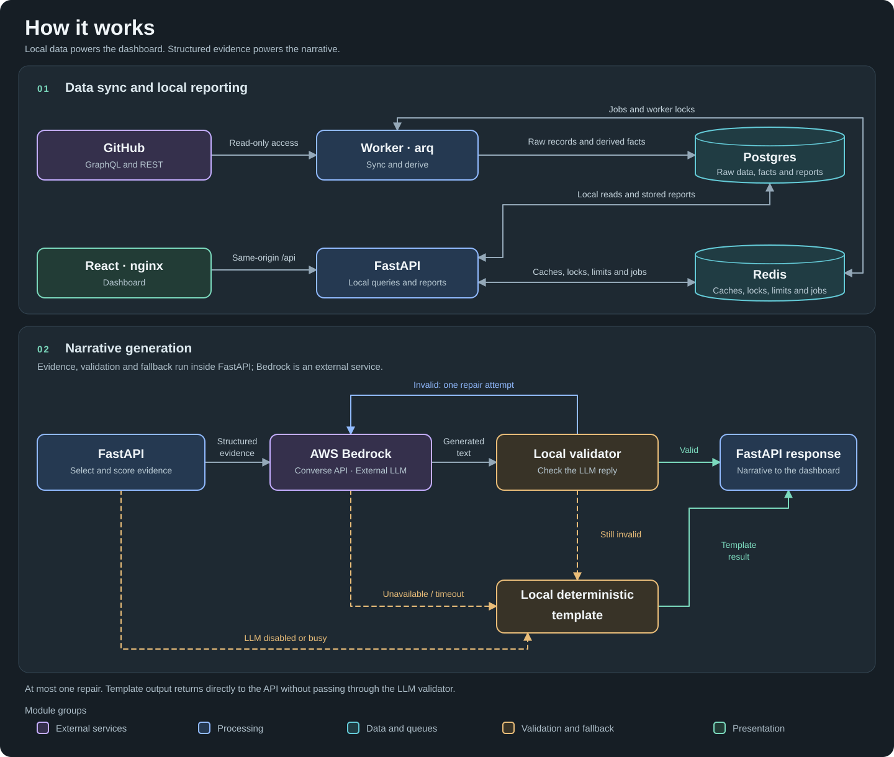

# Delivery Insights

Delivery Insights shows engineering managers and directors **where pull requests wait** and
which evidence supports an explanation. It syncs GitHub PR history in the background, computes
a deterministic time ledger and the evidence behind two scored hypotheses, and adds a cited
narrative written by Claude Sonnet 4.6 on Amazon Bedrock. Each claim in the narrative links to the number behind it, and every number comes from code.

## 1. How to run it locally

**Prerequisites:**

- Docker with Compose v2 (Docker Desktop on Windows/macOS).
- A GitHub fine-grained personal access token for live data: Settings → Developer settings → Fine-grained tokens,
  **Repository access: Public repositories**, no extra permissions.
- A Bedrock API key is required for LLM-generated narratives.

**Steps:**

1. **Create the configuration file.** If `.env` does not exist, copy `.env.example`:

    Bash:

    ```bash
    cp .env.example .env
    ```

    PowerShell:

    ```powershell
    Copy-Item .env.example .env
    ```

2. **Edit and save `.env` before starting Docker.** Open `.env` in a text editor.

   - Set `GITHUB_TOKEN` to your GitHub token to enable syncing public GitHub data.
   - Set `AWS_BEARER_TOKEN_BEDROCK` to your Bedrock API key to enable LLM-generated narratives.
   - Set `AWS_REGION` to the region used for Bedrock requests (default: `us-west-2`).
   - Set `BEDROCK_MODEL_ID` to the model or inference profile ID used by the Converse API
     (default: `us.anthropic.claude-sonnet-4-6`).

   Choose a region and model or inference profile that your AWS account can access and has
   available quota for; change the defaults if your quota is available elsewhere.

   Without a Bedrock key, narratives use deterministic templates and no LLM calls are made.
   Save the file before continuing.

3. **Start the services and check their status.** Run these commands after saving `.env`:

    ```bash
    docker compose up --build -d
    docker compose ps -a
    ```

    Expected status: `migrate` has exited with code `0`; `api`, `worker`, `web`,
    `postgres` and `redis` are running.
    It might take up to 5 minutes to prepare the reports.

- Dashboard: <http://localhost:5173>. API docs: <http://localhost:8000/docs>. Both bind to localhost only.
- The worker starts syncing `bevyengine/bevy` immediately: 7 days first, then 30, then
  `BACKFILL_DAYS=120`. Last 7/30 days become available first. Until a period is covered, the
  API returns `202` with `Retry-After`, and the dashboard shows progress and retries.
- To track more repositories, set `TRACKED_REPOS=owner/repo_a,owner/repo_b` and run `docker compose up -d` again. Other variables in `.env` are working defaults.
- Without `GITHUB_TOKEN` the stack still starts; `/v1/repos` reports `missing_token`.
- Check status: `curl -s localhost:8000/readyz`, `curl -s localhost:8000/v1/repos`, `docker compose logs --tail=50 worker`.
- Stop: `docker compose down` keeps data; `docker compose down -v` resets the database.

## 2. Architecture and main decisions



**01 — Local data and reporting:** the arq worker syncs GitHub history into Postgres and derives
PR timelines. FastAPI serves snapshots from local data; Redis supports jobs, caches, locks and
rate limits. The React dashboard accesses FastAPI through nginx.

Report routes share one API module; evidence definitions live with extraction, and the
PR-size comparison lives with efficiency metrics. Request cancellation shares the frontend
API module. Before/after comparisons confirm the OpenAPI contract and 15 synthetic snapshots,
evidence packs and template narratives are unchanged by this cleanup.

**02 — Narrative generation:** code computes metrics, selects evidence and scores hypotheses.
Bedrock writes the wording; local validation checks numbers, citations and uncertainty language,
with at most one repair. A deterministic template handles disabled, busy or failed LLM calls
and replies that remain invalid. Validation and fallback run inside FastAPI; PR titles,
comments and user names are never sent to the LLM.

Main decisions:

- **Metric:** cycle time and where PRs wait, measured in UTC elapsed time. PR-hours describe
  waiting; a large waiting share does not establish a cause or measure engineering effort.
- **Scope:** every section uses PRs opened or with human activity in the selected period.
  Older idle PRs may require a longer window to appear.
- **Reproducibility:** background sync keeps GitHub I/O off the request path. Pure analytics
  and snapshots identified by parameters, versions and watermarks support repeatable reports.
- **Evidence strength:** fixed rules score hypotheses, calibrated on synthetic scenarios only.
  Weak evidence or no slowdown leads to abstention; the score is not a probability.
- **Constraints:** English narratives and public repositories only.
- **Project scope:** The broader scope gave the narrative more complete evidence, at the cost
  of additional implementation complexity. In retrospect, I would keep the initial delivery
  focused on the required path and add extensions only where their value justified the added
  complexity.

## 3. With one more day
I would do one of the followings if I had one more day: 
1. **Add a "Sync now" button** for tracked repositories in the dashboard, backed by a
   manual sync endpoint with a cooldown; the worker already runs on-demand sync jobs.
2. **Add a point-in-time "all open PRs" view** for backlog and at-risk stock, beside the
   period-active view.
3. **Harden sync:** reconcile jobs killed mid-run at startup, and retry GraphQL throttling
   returned with HTTP 200 and dropped connections.
4. **Speed up the first sync:** split the initial time window into date ranges and fetch them 
   in parallel using GraphQL search with updated: filters, instead of fetching one page at a time. 
   Also sync tracked repositories in parallel while staying within the shared GitHub rate limit. 
   Snapshot analytics already runs outside the event loop. If it becomes slow on large repositories, 
   move it to a process pool, because threads do not speed up CPU-heavy Python work.

## 4. How AI was used

- **My role:** I led the project, defined the scope, roadmap, tech stack and architecture,
  and made the product decisions around metrics, trade-offs and the period-scoped dashboard.
  I directed the AI-assisted work, reviewed the plans and code diffs, and made the final
  design decisions.
- **Claude (Anthropic):** supported brainstorming, drafting the design and implementation
  plan, code review and targeted improvements, under my lead and direction.
- **Codex (OpenAI):** assisted with implementation, fixes and verification across the backend,
  frontend, migrations, tests, evaluation harness, containers and CI, following my direction
  and review feedback.
- **Claude Sonnet 4.6 on Bedrock** is part of the product: it writes narrative wording only,
  and the deterministic validator decides whether it is shown.
- **How the output was checked:**
  - 318 backend tests, 63 of them on real Postgres 16 and Redis 7, plus 15 frontend tests.
  - Strict ruff/mypy and the frontend typecheck and build.
  - The current 15-case offline and real Bedrock evaluations on prompt v13 pass all eight
    gates. The real run is first-valid in 14/15 cases, the one invalid first answer is
    fixed by its repair, and no case falls back to the template; numeric, citation and
    hedge consistency are 15/15 each for final LLM outputs.
  - Real GitHub sync and browser checks.
  - CI removal checked field by field: every retained golden snapshot value is unchanged;
    synthetic browser checks cover presets, a custom period, pending, configuration, narrative
    and the three-state ledger. After the user's database rebuild, the Bevy worker completed
    the 120-day backfill and precomputed the 7/30/60-day reports.

## What you get

- **Repository and period:** a tracked repository and the last 7, 30 (default) or 60 days, or
  custom UTC dates, compared with the preceding period of equal length. Every section counts PRs
  opened, or with recorded human activity, during the period.
- **Sync progress:** until the period is covered, the page shows the sync stage and retries; a
  configuration notice names the `.env` setting to fix.
- **Narrative:** root-cause hypotheses scored by fixed rules, with every claim cited to its
  metric. When delivery did not slow down, or evidence is too weak, it says so and points to
  where PR time goes now.
- **Where PR time goes:** the time ledger of merged PRs across reviewer, author and merge
  waiting, current period against the previous one.

## API

| Method | Path | Purpose |
|---|---|---|
| GET | `/v1/insights/delivery?repo=…&from=…&to=…` | Snapshot for one repository and period, or `202` sync progress |
| GET | `/v1/snapshots/{snapshot_id}/narrative` | Cited narrative, hypotheses and evidence for that snapshot |
| GET | `/v1/repos` | Tracked repositories, sync status, date limits and configuration health |
| GET | `/healthz`, `/readyz` | Liveness and Postgres/Redis readiness |

```bash
curl -s "http://localhost:8000/v1/insights/delivery?repo=bevyengine/bevy&from=2026-09-04&to=2026-10-03"
```

Dates are inclusive UTC dates. Errors use RFC 9457 `application/problem+json`. Current contract: [REFERENCE.md](docs/REFERENCE.md#api) and the strict models in
`backend/src/insights/api/schemas.py`.

## Configuration

Settings come from `.env`; never commit it. Without `.env`, code defaults apply (`backend/src/insights/config.py`):
`TRACKED_REPOS=bevyengine/bevy` and `BACKFILL_DAYS=120`.

| Variable | `.env.example` | Purpose |
|---|---|---|
| `GITHUB_TOKEN` | empty | Required for sync; without it `/v1/repos` reports `missing_token` |
| `AWS_BEARER_TOKEN_BEDROCK` | empty | Required for LLM-generated narratives; without it, only deterministic templates are available |
| `AWS_REGION`, `BEDROCK_MODEL_ID` | `us-west-2`, `us.anthropic.claude-sonnet-4-6` | Bedrock Converse target |
| `TRACKED_REPOS` | `bevyengine/bevy` | Comma-separated allowlist, e.g. `bevyengine/bevy,prometheus/prometheus` |
| `BACKFILL_DAYS` | `120` | History to collect (30–365); the 60-day view needs at least 120 for a full comparison |
| `PRECOMPUTE_DAYS` | `7,30,60` | Snapshot windows warmed after a successful sync changes repository data |
| `LOCATION_DIMENSION` | `label:area-` | Area grouping: matching labels, otherwise directories |

## Development

```bash
make lint          # ruff + strict mypy
make test-unit     # backend unit tests
make test          # full suite; integration tests need Docker (Testcontainers)
make eval-offline  # 15-case synthetic narrative evaluation with a stub LLM
make eval          # same against real Bedrock (reads the key from .env)
cd frontend && npm ci && npm test && npm run typecheck && npm run build
```

The snapshot contains the time ledger and the metrics supporting the review-capacity and
PR-size hypotheses. CI telemetry, its hypothesis and Actions collection have been removed.
Analytics and prompt versions isolate existing snapshots and narrative caches; workers
rederive PR timelines from lifecycle events. Bootstrap sampling keeps its frozen identity.

The unreleased application keeps one migration, `0001_initial`, which is edited in place
until release. A database created by an earlier version of that file must be deleted and
synced again; an in-place upgrade is unsupported. After explicitly confirming that
collected PRs, snapshots and narratives may be deleted, run:

```bash
docker compose down -v
docker compose up -d --build
```

The worker resumes collection from an empty database, with 7-, 30- and 120-day backfill
checkpoints under the default configuration. Wait for repository `last_sync_status=ok`
and full coverage before checking the dashboard. Keep `BACKFILL_DAYS=120` for the 60-day
view and its comparison period.

Local checks: **318 backend tests** (255 unit, 63 integration), **15 frontend tests**,
strict lint/types/build and all eight offline and real Bedrock narrative gates pass on
prompt v13 (no template fallback). Results are in
[REFERENCE.md](docs/REFERENCE.md#testing-and-evaluation).

The module cleanup preserves the OpenAPI contract and computed/narrative outputs. Request
cancellation now lives in `frontend/src/api.ts`; frontend type checking also rejects unused
locals and parameters. Current module boundaries are described in
[REFERENCE.md](docs/REFERENCE.md#development).

## Documentation

| Document | Contents |
|---|---|
| [docs/REFERENCE.md](docs/REFERENCE.md) | Metric definitions, confidence scoring, API, operations, security, test and evaluation results, limitations |
