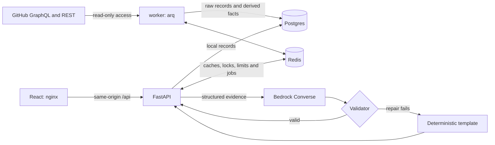

# Technical reference

Detailed behavior moved out of the README. Start with the [README](../README.md) and [NOTES](../NOTES.md).
Current contracts are in code and this reference; [the consolidated plan](plan/PLAN.md) retains historical design input. Implementation decisions are in [DECISIONS.md](DECISIONS.md).

## The insight and why this metric

The core metric is **PR cycle time and where it waits**: first commit to merge,
split into coding, reviewer wait, author wait, observed CI wait and merge wait.
Each report combines team outcomes with bottleneck analysis and the previous period.
The headline connects the outcome, the largest bottleneck and an illustrative action.

| View | Question | Decision it supports |
|---|---|---|
| Cycle median and p90 | Is delivery slower, including the tail? | Investigate a change in the process |
| Waiting share | How much of the whole cycle is waiting? | Separate active work from handoffs |
| Time ledger | Who or what is the post-ready wait for? | Review capacity, CI or merge policy |
| Location and queue | Where is demand exceeding capacity? | Add area reviewers or improve assignment |
| Reverts and waste | Is apparent speed buying quality risk? | Review guardrails beside cycle time |
| At-risk PRs | Which open changes exceed historical waits? | Triage concrete work |

Waiting share uses coding plus active post-ready time as its denominator.
The time ledger uses only post-ready waiting states; its shares have a different denominator.
Dashboard cards state their sample units: merged PRs, eligible ready-for-review PRs, closed or
merged PRs, or review events. Review rounds counts feedback transitions back to the author,
not individual reviews; averages display up to two decimal places. Relative changes use
unrounded values, so recomputing them from displayed values can differ slightly. In-page
guides explain sample sizes, statistical status, table columns and impact denominators.
These are PR-flow signals, not deployment lead time, DORA change failure rate,
individual productivity scores or causal proof. Workflow and timestamp changes affect them.

## How it works



1. **Sync:** staged backfill, overlapping incremental windows and open-PR sweeps write idempotent batches. Checkpoints advance only after successful phase completion.
2. **Derive:** a causal state machine creates non-overlapping intervals and per-PR facts. Reverts, relands and superseded PRs are linked; ownership changes trigger rederivation.
3. **Snapshot:** one repeatable-read database view feeds pure analytics, deterministic bootstrap comparisons and canonical JSON. Parameters, versions and watermarks set identity.
4. **Narrative:** code selects evidence and scores hypotheses. Bedrock supplies wording; code validates it, repairs once if necessary, then falls back to a checked template.

| Component | Responsibility |
|---|---|
| `api` | Local-data queries, snapshot/narrative persistence, manual sync enqueueing |
| `worker` | GitHub ingestion, derivation, enrichment, precomputation, retention |
| `postgres` | Source data, facts, intervals, immutable snapshots and narratives |
| `redis` | arq jobs, locks, response caches and fixed-window limits |
| `web` | React dashboard and nginx same-origin proxy |
| `migrate` | One-shot Alembic schema upgrade before API/worker startup |

Analytics has no database or HTTP imports. The I/O loader lives in `db/dataset.py`.
The API process does not import source adapters or call GitHub on requests.
It may call Bedrock for an uncached narrative; heavy analytics and boto3 run in threads.

## API

OpenAPI is available at `/openapi.json` and `/docs`; the historical design is
[API contract chapter](plan/PLAN.md#plan-06). Dates and timestamps use UTC.
`from` and `to` are inclusive dates; comparison uses the preceding equal-length period. `as_of` is capped by the least recent repository sync watermark.

| Method | Path | Purpose |
|---|---|---|
| GET | `/v1/insights/delivery` | Insight snapshot for selected repositories and dates |
| GET | `/v1/insights/delivery/prs` | Filtered and paginated PR detail |
| GET | `/v1/snapshots/{snapshot_id}` | Read a retained immutable snapshot |
| GET | `/v1/snapshots/{snapshot_id}/narrative` | `audience=director\|manager`, `lang=en` only (default) |
| GET | `/v1/repos` | Whitelist, freshness and sync status |
| POST | `/v1/repos/{owner}/{name}/sync` | Enqueue a manual sync |
| GET | `/v1/sync-jobs/{job_id}` | Inspect sync progress |
| GET | `/healthz` | Process liveness |
| GET | `/readyz` | Postgres and Redis readiness |

Repeated `repo=` values aggregate tracked repositories; `org=` selects only tracked
repositories of that owner. Percentiles pool PRs; query a single repository for a separate view.
Unknown parameters are rejected. Invalid input returns `422`; untracked repos return `403`.
Errors use RFC 9457 `application/problem+json` with `request_id` and sanitized detail.

Once sync has produced a `200` response:

```bash
API=http://localhost:8000
TO=$(python3 -c 'import datetime as d; print(d.datetime.now(d.timezone.utc).date())')
FROM=$(python3 -c 'import datetime as d; print(d.datetime.now(d.timezone.utc).date()-d.timedelta(days=29))')
curl -sD /tmp/di-headers "$API/v1/insights/delivery?repo=bevyengine/bevy&from=$FROM&to=$TO" -o /tmp/di-snapshot.json
SID=$(python3 -c 'import json; print(json.load(open("/tmp/di-snapshot.json"))["snapshot_id"])')
ETAG=$(python3 -c 'from pathlib import Path; print(next(s.split(":",1)[1].strip() for s in Path("/tmp/di-headers").read_text().splitlines() if s.lower().startswith("etag:")))')
curl -i -H "If-None-Match: $ETAG" "$API/v1/insights/delivery?repo=bevyengine/bevy&from=$FROM&to=$TO"
curl -s "$API/v1/snapshots/$SID"
curl -s "$API/v1/snapshots/$SID/narrative?audience=manager&lang=en"
```

The conditional request returns `304` with no body. Insights have a 60-second private
HTTP cache; snapshots by ID have a one-day immutable cache. Successful narratives and
disabled-LLM templates have `private, max-age=3600`; failure fallbacks use `no-store`.
Internal Redis TTLs are separate from HTTP cache directives.

A `202` is a Pending object, not a snapshot. Respect `Retry-After`; inspect each repo's
`reason` and `job`. The UI polls for at most five minutes, then asks for a later refresh.
PR pages accept `status`, `at_risk`, `state`, `location`, `limit` and `cursor`.
A cursor is tied to snapshot identity and filters; refresh if the data version changes.

## Snapshot contract in analytics 1.5.0

The strict `api/schemas.py` models are the current field contract (`extra="forbid"`).
Retained metrics, samples, comparisons, significance, findings and their what-if estimates,
risks, location rows including `owners_count`, headline and links retain their values.
Only outputs without dashboard, narrative, finding or eval consumers were removed:

| Block | Removed outputs |
|---|---|
| Root / bottleneck summary | `per_repo`, `pareto`, the summary `what_if` list (finding-level `what_if` stays) |
| Merge blockers / drivers | Unused approved-count/second-approval/CI-after-approval metrics; author-WIP, submit timing, review-round buckets/cost/first pickup (re-review wait stays) |
| Waste / rework | Closed count, class/share diagnostics; revert/reland counters and chain original/reland/exposure/cycle fields (revert URL stays) |
| Trend / CI | Bottleneck shift, attribution total-hours/reviewer-share diagnostics; rerun rate, runs per PR, workflow/source/coverage diagnostics (ledger CI availability/coverage stays) |
| Metadata / risk | Exclusion/location-source diagnostics, extra sample counts, risk-by-state, risk PR size/external contributor |
| Ledger / guardrail / series | Ledger scope/previous count/total, prior revert-rate/change-pp, queue growth, weekly days/reverts, KM step/events outputs |

Identity and caches use analytics 1.5.0. Sampling uses `digest(seed_params)[:16]` with exactly
the former canonical parameter structure and only `analytics_version` replaced by frozen
`SAMPLING_SEED_VERSION="1.4.0"`. Existing snapshots and narrative caches remain isolated;
HTTP conditional requests still return 304 for matching current ETags. Repositories with old
derived versions enter the existing rederivation path. No schema reset is needed for stages 1–8.

## Narrative, confidence and evidence chain

Confidence is a **deterministic evidence-strength score**, not a probability.
It has not been calibrated against real repository outcomes or hand-labeled causes.
Correlations, queue pressure and what-if estimates are reasons to investigate, not proof.

The model sees structured numbers, evidence IDs and sanitized repository/location names.
It never sees PR titles, bodies, comments or user names. Code supplies evidence references,
sample counts, changes, guardrails and eligible hypotheses from this library:

| Hypothesis | Symptom | Mechanism to look for |
|---|---|---|
| Review capacity | More time waiting for review | Demand, concentration and localized first-review delay |
| CI bottleneck | More observed CI waiting | Queue/runtime increases or flaky reruns |
| PR size growth | Longer cycle or author/review stages | Larger changes with extra review/rework |
| Quality trade-off | Faster cycle | Reverts or unusually fast approval of large changes |

```text
score = 0.30*S + 0.20*E + 0.20*P + 0.15*N + 0.15*L - 0.15*C
```

| Factor | Meaning |
|---|---|
| S | Fraction of evaluable symptom/mechanism signals present |
| E | Direction-aware effect size against previous weekly variability |
| P | Fraction of current weeks supporting the change |
| N | `min(1, main_metric_sample_size / 100)` |
| L | Localization/concentration, defined for each hypothesis |
| C | Number of counter-evidence groups present |

Example covered by tests: S=4/5, E=1, P=10/13, N=61/100, L=0.63, C=0
gives 0.7798, rounded to **0.78 (high)**. One counter-evidence group yields **0.63 (medium)**.
No mechanism signal means no hypothesis, even when symptoms look strong.
CI confidence is capped at 0.50 unless CI is available, coverage is at least 0.50,
and `CI_COMPLETE=true`. The default is false because Actions may be only partial CI.

| Score after caps and rounding | Level | Wording |
|---|---|---|
| At least 0.75 | high | likely |
| Greater than 0.50, below 0.75 | medium | may / might / possibly / could |
| 0.35 through 0.50 | low | early signs |
| Below 0.35, missing comparison or mechanism | abstain | `no_slowdown`, `insufficient_signal` or `no_comparison` sentence |

Validators check schema, IDs, sentence-local numeric grounding, units, direction,
citation coverage, personal identifiers and causal wording ceilings across the whole body.
An LLM may downgrade a candidate, never raise its deterministic score or wording level.
At most one outside-library hypothesis is allowed and fixed at low confidence (0.35).
Invalid output is repaired once using the previous output and exact validation failures.
Timeouts, errors or a second invalid answer return a deterministic template.
Inspect `meta.generated_by`, `validation`, `attempts`, `fallback_reason` and `violations`.
In the UI, citation buttons scroll to and highlight the corresponding evidence entry.

## Configuration

Copy `.env.example`; never commit `.env`. Full environment defaults are in `backend/src/insights/config.py`.

| Variable | Default | Purpose |
|---|---|---|
| `GITHUB_TOKEN` | empty | GitHub collection; missing token is reported explicitly |
| `AWS_BEARER_TOKEN_BEDROCK` | empty | Optional Bedrock API key; empty enables templates |
| `AWS_REGION` | `us-west-2` | Bedrock client region |
| `BEDROCK_MODEL_ID` | `us.anthropic.claude-sonnet-4-6` | Converse model/inference profile |
| `TRACKED_REPOS` | `bevyengine/bevy` | Comma-separated repository allowlist |
| `LOCATION_DIMENSION` | `label:area-` | Label, CODEOWNERS or directory grouping |
| `BACKFILL_DAYS` | `120` | Final backfill stage, between 30 and 365 |
| `SYNC_INTERVAL_MINUTES` | `15` | Incremental cadence; must divide 60 |
| `CI_SOURCE` | `actions` | `actions` or `none` |
| `CI_COMPLETE` | `false` | Assert complete CI only when justified by the repository |
| `CORS_ORIGINS` | `http://localhost:5173` | Comma-separated allowed browser origins |
| `RATE_LIMIT_PER_MINUTE` | `120` | Per-client-IP fixed-window limit on `/v1` |
| `DATABASE_URL` | Compose Postgres URL | Async SQLAlchemy database connection |
| `REDIS_URL` | `redis://redis:6379/0` | Cache, job queue and locks |

Create the GitHub token under Settings → Developer settings → Personal access tokens
→ Fine-grained tokens. Choose Public repositories, an expiration and no extra permissions.
The current implementation targets public repositories; private-repo authorization is not verified.
Model availability and Bedrock access/billing must be verified in your AWS account.
Set `CI_COMPLETE=true` only if Actions telemetry covers the CI you intend to measure.

## Operations

Use `/healthz` for liveness and `/readyz` for dependency readiness. Read `/v1/repos`
before judging missing data. Snapshots/narratives are retained for seven days and sync-job
records for thirty days; source PR records are retained until the database is reset.
Worker housekeeping expires retained data and precomputes 7-, 30- and 60-day reports.

```bash
curl -s http://localhost:8000/readyz
curl -s http://localhost:8000/v1/repos
curl -i -X POST http://localhost:8000/v1/repos/bevyengine/bevy/sync
docker compose logs --tail=50 api worker
```

Manual sync responds `202` with `Location`; repeating it during the 300-second cooldown
returns `429` with `Retry-After`. General rate limiting also returns `429`.
Requests proxied through nginx share its upstream client-IP bucket; this is a local demo.
Cache/rate-limit Redis failures are fail-open where possible; readiness still reports failure.
Worker locks are renewed; checkpoints support resumption. Compose restarts failed workers.

Access logs are JSON with `request_id`, `method`, `path`, `status` and `duration_ms`.
Worker application events include `job`, `repo` and `phase`; CLI bootstrap logs are JSON too.
Snapshot logs separate `duration_ms`, `load_ms`, `compute_ms` and `merged_prs`.
Tokens, headers, raw upstream responses and prose are not logged; exceptions expose only type.

| Symptom | What to inspect |
|---|---|
| Persistent 202 | Pending `reason`/`job`, repository coverage and sync status |
| `rederive` | A configuration/version change requires complete fact rederivation; failed jobs retry next sync |
| `stale` | The consistent sync watermark has not reached the requested period |
| `missing_token` / 503 | Add GitHub credentials and recreate API/worker with the environment |
| Always template | `meta.fallback_reason`, model access, validator violations and sanitized logs |
| 404 for an old snapshot | Seven-day retention expired; request a new insight |
| Incomplete comparison | More history is needed for the previous equal-length period |

`docker compose down` stops the stack while preserving Postgres data.
`docker compose down -v` intentionally deletes the local database volume; use only for reset.
The unreleased storage schema is consolidated into `0001_initial`. Earlier three-migration
databases require that confirmed reset and a new sync; applying this revision in place is
unsupported. `links_pending` is included in the initial schema. Raw GitHub node IDs and
actor types remain in the query for timeline paging and bot detection; five unused PR fields,
four audit/duplicate metadata fields and seven unused fact fields are no longer persisted.
Only the `ix_intervals_pr` index was removed, because `UNIQUE(pr_id, seq)` covers its prefix.
Other indexes remain; no performance claim is made without representative EXPLAIN measurements.
There is no authenticated administrative UI or backup orchestration in this demo.

## Security

- Secrets are environment-only `SecretStr` values; `.env` and local artifacts are ignored.
- Query/path inputs use allowlists. Repositories must be tracked. GitHub base URLs come
  only from trusted configuration; the REST client rejects absolute request URLs.
- SQLAlchemy statements are parameterized; SQL `text()` usage is limited to static statements/defaults.
- The evidence pack excludes raw PR text and user names; unsafe location names are replaced.
- Problem responses omit tracebacks and upstream exception text.
- React renders all server text as text; external links allow only `https://github.com/`.
- nginx sets CSP, `nosniff` and `no-referrer`. There are no external scripts or fonts.
- Application containers run as UID 10001; web runs as UID 101.
- Loopback binding limits the demo's exposure. Production requires authentication,
  authorization, TLS, secret rotation and an appropriate deployment security review.

## Testing and evaluation

Tests focus on accounting boundaries and failure behavior, not only happy-path output.
They cover 22 specified timeline cases plus 200 random invariant sequences, deterministic
golden output under shuffled input, sample gates, observed CI waits, KM censoring/ties, drivers,
resumable ingestion, snapshot identity/expiry, privacy, validators and fallback races.
Integration tests use actual Postgres 16 and Redis 7 through Testcontainers; GitHub and
Bedrock calls are mocked or SDK-stubbed. Docker must be running for the full suite.

```bash
make lint
make test-unit
make test
make eval-offline
# Reads AWS_BEARER_TOKEN_BEDROCK from root .env:
make eval
# Requires live GitHub data; waits up to five minutes:
make smoke
```

Latest refactor checks: 2026-10-04 UTC, analytics 1.5.0, prompt v8.

| Check | Observed result |
|---|---|
| Ruff check/format and strict mypy | Pass |
| Unit suite | 333 cases in the passing full suite |
| Full suite | 402 passed, including 69 integration tests |
| Frontend tests, typecheck and build | 9 tests passed; typecheck/build pass with Node 24 |
| Real sync / browser recovery | 50 rows → stale cursor 422 → rows cleared → refresh → 50 matching rows |
| Refactor equivalence | Remaining snapshot values, evidence, scoring, templates, assembly, validator codes match `pre-refactor`; only allowlisted deletions and recomputed identity fields differ. Prompt messages matched through stage 7; stage 8 changes only prompt wording/format |
| Refactored UI (synthetic fixtures) | Both views; 7/30/60 days; 5 → 12 risk rows; ownership counts; card/citation focus; three abstentions; pending sync; no console errors |
| Stage 9 confirmed live rebuild | Bevy 7/30/120-day backfill and CI completed with zero invariant violations/skipped PRs; incremental changed zero PRs and all 1,640 hashes matched; 7/30/60-day HTTP/ETag and both views passed. Owners are null because the source yielded zero rules. Six final LLM responses passed, with separate current-day 60-day template fallbacks recorded in [storage evidence](storage-rebuild-verification.json) |

Earlier acceptance measured 3,541 PRs with no invariant violations, three matching PR pages, 533 merged PRs with ledger rounding error 0.0000004833, cold compute 1,376.95 ms and warm HTTP p95 32.32 ms.
Those analytics 1.2/1.3 measurements and npm ci/audit checks were not repeated here. They are local measurements, not production load evidence.
The original 90-day performance gate remains excluded; nine upstream deprecation warnings remain.

The harness runs five planted scenarios × two seeds × two English audience variants.
Both offline and real Bedrock Sonnet 4.6 suites were run on analytics 1.5.0 and final prompt v8. The rejected v8 candidates are retained in the evaluation records.
[Evaluation records](EVALUATION.md) retain every current and historical per-case outcome.
Numeric/citation/hedge denominators include final LLM outputs, excluding fallback.

| Metric | Offline (v8) | Real Bedrock (v8) | Required |
|---|---|---|---|
| First-attempt validity | 20/20 (1.00) | 20/20 (1.00) | ≥ 0.90 |
| Numeric / citation / hedge consistency | 20/20 each | 20/20 each | 1.00 each |
| Root-cause hit rate | 14/16 (0.875) | 14/16 (0.875) | ≥ 0.80 |
| No-signal abstention | 4/4 (1.00) | 4/4 (1.00) | ≥ 0.80 |
| High-confidence precision | 14/14 (1.00) | 14/14 (1.00) | ≥ 0.80 |
| Fallback rate | 0/20 (0.00) | 0/20 (0.00) | ≤ 0.10 |

The final v8 offline and real-Bedrock suites pass all gates. Quality-tradeoff seed 101 abstains because its
previous-period baseline fails the five-event gate; thresholds are unchanged.
Medium/low precision is undefined. Failed v1/v2 and English v4/v5 trials remain
recorded, together with rejected stage-8 candidates A/B. Earlier rebuilt-API English-only real-manager HTTP smoke is historical; the refactor UI check used synthetic fixtures.
This small synthetic suite was used during prompt development; it is not a held-out
benchmark or real-world causal calibration. Missing-key evaluation exits 2.

## Trade-offs and limitations

### Key trade-offs

| Decision | Choice and cost | Follow-up |
|---|---|---|
| Time basis | UTC wall-clock, including nights/weekends | Add team calendars |
| Multi-repo | Pool PRs; larger repos dominate aggregate percentiles | Query each repository separately |
| Locations | Current labels → CODEOWNERS → directories; historical labels unavailable | Inspect location rows and current ownership configuration |
| Scope | Default-branch flow; bots/backports excluded | Separate release-branch view |
| Freshness | Background sync, default 15 minutes | Webhooks if lower latency is needed |
| Sources | Whitelisted GitHub repos only | Extend `SourceAdapter` with shared normalized records |
| Snapshot compute | Concurrent cold requests can duplicate deterministic work | Add single-flight only if measured necessary |
| Commit times | Committer timestamps approximate push/revision time | Collect push events |
| Reopened PRs | Closed intervals excluded from ledger; elapsed milestones retain them | Review prevalence before changing duration semantics |
| CI | Actions only, possibly partial; incomplete-CI score cap | Collect check runs, including Azure Pipelines |
| Confidence | Evidence score tested only on synthetic scenarios | Replay history and calibrate with human labels |
| Size scenario | Synthetic duration scales with square root of planted size multiplier | Validate this assumption with real observations |

Implementation-specific decisions and their reasons are recorded in [DECISIONS.md](DECISIONS.md).

### Things deliberately not done

No individual productivity rankings, request-time GitHub fetching, arbitrary repo/org discovery,
LLM arithmetic, self-assigned LLM confidence or raw-text prompts. No authentication, deployment
integration, webhook ingestion, second source adapter implementation or business-hours mode.
Linked chains are stored, but chain-level elapsed delivery time is deferred.
Real-history backtesting, human calibration, AI-authorship analysis, stacked-PR dependency
waiting, cumulative-flow charts and release/deployment timing remain outside this version.

### Beyond the brief

Implemented: deterministic evidence scoring and validation, repair/template fallback, immutable
snapshots and ETags, multi-repo aggregation, PR drilldown, staged backfill/open sweeps,
four narrative variants, offline eval, React dashboard, CODEOWNERS/area-owner enrichment,
Actions CI waiting, drivers, Kaplan–Meier survival, historical predictability, Docker and CI config.

### Known limitations

- PRs that have been open without human activity during the selected period are not listed;
  extend the date range to include them.
- Stale PRs closed by a bot are not counted as waste unless they were opened or had human
  activity in the period.
- PRs opened before the selected period and merged by a bot with no human activity in
  the period are not counted in throughput.

GitHub omits design discussions, offline coordination and deployments. Rewritten or rebased
commit timestamps distort coding time. Current labels/owners are not historical ownership.
Private membership prevents expanding some owner teams into people; teams count as owners.
Small samples suppress p50 below 20, p90 below 30, and rates below 30 cases/5 events.
Driver/location measures have their own documented gates. Insufficient values remain null.
Actions telemetry may omit the demo repository's primary Azure Pipelines CI.
Confidence still needs historical replay and human labels.
Skipped PRs and anomalous timelines can affect metrics; inspect sync job skipped_prs and invariant_violations counters and their structured warnings before relying on a report.
Net review-demand share compares arrivals with first reviews, including service of earlier demand; it can be negative and is not an individually tracked unreviewed-PR fraction.
The plan-selected Recharts 2 branch is deprecated; migration to v3 is a maintenance follow-up.
The supplied golden fixture still needs a person's numeric review; browser checks here were
performed by the coding agent, not signed off by a human. Remote CI has not been run.

## Development

Use Python 3.12 and uv for backend development, Node 24 for the frontend.
Lockfiles are committed; use frozen installs for reproducibility.

```bash
cd backend
uv sync --frozen
uv run ruff check .
uv run ruff format --check .
uv run mypy
uv run pytest -m "not integration"
uv run pytest
uv run python -m insights_eval.run --llm stub
cd ../frontend
npm ci
npm test
npm run typecheck
npm run build
npm run dev
```

Vite proxies `/api` to the local API. Compose serves the built UI through nginx instead.
Make targets: `up`, `down`, `logs`, `lint`, `fmt`, `test-unit`, `test`, `eval-offline`, `eval`, `smoke`.
The GitHub Actions workflow applies backend lint/tests/eval and frontend typecheck/build.

| Directory | Contents |
|---|---|
| `backend/src/insights/` | API, source, sync, database, analytics and narrative modules |
| `backend/migrations/` | Consolidated Alembic initial schema; earlier databases require reset/resync |
| `backend/tests/` | Unit, integration, fixture and golden checks |
| `backend/eval/` | Synthetic generator, scenarios and evaluation runner |
| `frontend/` | React/TypeScript UI, shared abortable requests/formatting/links, Vite config and nginx image |
| `backend/src/insights/snapshots/` | Shared orchestration, caching, filtering and domain errors |
| `backend/src/insights/sync/queue.py` | Shared job lifecycle, locks, queue helpers and success lookup |
| `scripts/` | HTTP smoke entrypoint |
| `docs/plan/PLAN.md` | Consolidated historical design input |
| `docs/` | Decisions, acceptance evidence and evaluation records in Markdown |
