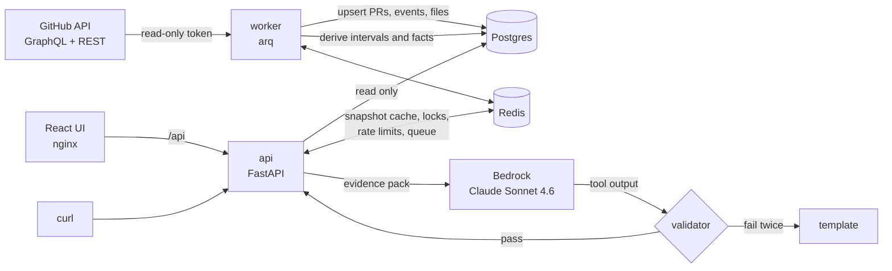

# 11 README 与提交说明

## 1. 要求

- `README.md` 放在仓库根目录，**英文**，评审会像读队友的 PR 一样读它。提交说明就是 README 中的 "Submission notes" 一节，不另建文件。
- 篇幅控制在 300–450 行；表格优先于长段落；每节先给结论。
- **不写没有验证过的数字**。耗时、样本量、真实结果等只写实际测到的；没有凭证、没测到的写成不带数字的描述，并在最终报告的"待人工验证"中列出。
- README 中的命令必须与 Makefile、Compose、`.env.example` 一致，M12 逐条执行一遍。
- 作业 PDF 对 NOTES / README 的要求：说明取舍和刻意不做的事、**如何使用了 AI（用来做什么、怎么用）**、**再多一天会做什么**；提交形式为公开的 Git 仓库，或包含 `.git` 目录的 zip / tarball（PDF 第 3–4 页）。对应 §7.5、§7.6 和 §9。

## 2. 章节结构（按顺序）

1. **Delivery Insights**：一段话说明服务做什么、给谁用（engineering managers and directors）、两个 endpoint。
2. **Quickstart (60 seconds)**：见 §3。
3. **The insight and why this metric**：见 §4。
4. **How it works**：Mermaid 架构图（§5）、数据流四步（sync → derive → snapshot → narrative）、组件列表（api、worker、postgres、redis、web、migrate）。
5. **API**：`06` §1 的 endpoint 表；3–4 个 curl 示例（取自 `06` §8：insight、304、snapshot、narrative）；说明 202 / `Retry-After`、problem+json、ETag；指向 `/docs`。
6. **Narrative, confidence and evidence chain**：证据包、假设库（4 个假设的症状和机制各一行）、置信度公式和一个算例（`07` §4.5）、档位与措辞、校验器（逐句核对数字来自本句引用的证据、正文措辞不超过假设档位）、重试一次、模板兜底、`generated_by`。明确写出：置信度是确定性的**证据强度分数，没有用真实数据校准过**，不是概率（见 §7.1）。
7. **Configuration**：环境变量表（`02` §1 中用户需要关心的：`GITHUB_TOKEN`、`AWS_BEARER_TOKEN_BEDROCK`、`AWS_REGION`、`BEDROCK_MODEL_ID`、`TRACKED_REPOS`、`LOCATION_DIMENSION`、`BACKFILL_DAYS`、`SYNC_INTERVAL_MINUTES`、`CI_SOURCE`、`CI_COMPLETE`、`CORS_ORIGINS`、`RATE_LIMIT_PER_MINUTE`），以及如何创建 fine-grained token（Repository access 选 "Public repositories"，不加权限）。
8. **Operations**：健康检查；结构化日志（字段）；同步状态（`GET /v1/repos`）和手动同步；数据保留（快照 7 天、同步任务 30 天）；限流；重置数据（`docker compose down -v`）；常见问题（202 一直不结束 → 看 Pending 中的 `reason` 和 `job`，以及 `last_sync_status`；`reason = rederive` 表示配置或版本变化后正在整仓重推导，失败的重推导会在下一个同步周期自动重试；叙述总是模板 → 查 `meta.fallback_reason`）。
9. **Security**：§6。
10. **Testing and evaluation**：测什么、为什么（`10` §1、§7 的摘要）；命令；最近一次 `make test` 和 `make eval-offline` 的结果（M12 执行后填写真实数字）；`make eval` 需要 Bedrock key。
11. **Submission notes**：
    1. Key trade-offs（§7.1）
    2. Things deliberately not done（§7.2）
    3. Beyond the brief（§7.3）
    4. Known limitations and next steps（§7.4）
    5. AI assistance（§7.5，作业要求）
    6. With one more day（§7.6，作业要求）
12. **Development**：`make` 目标、目录结构（一层即可）、`docs/plan/`（实施计划）、`docs/DECISIONS.md`（实现中的决定）。

## 3. Quickstart 模板

````markdown
## Quickstart (60 seconds)

Prerequisites: Docker with Compose v2, and a GitHub fine-grained personal access token with
**Repository access: Public repositories** and no extra permissions.

```bash
cp .env.example .env          # set GITHUB_TOKEN; optionally AWS_BEARER_TOKEN_BEDROCK
docker compose up --build -d
open http://localhost:5173    # UI   (API docs: http://localhost:8000/docs)
```

The worker starts backfilling `dotnet/runtime` immediately (7 days first, then 30 and 180).
Until the requested period is covered the API answers `202 Accepted` with `Retry-After`,
and the UI shows sync progress.

```bash
TO=$(python3 -c 'import datetime as d; print(d.datetime.now(d.timezone.utc).date())')
FROM=$(python3 -c 'import datetime as d; print(d.datetime.now(d.timezone.utc).date() - d.timedelta(days=6))')
curl -s "http://localhost:8000/v1/insights/delivery?repo=dotnet/runtime&from=$FROM&to=$TO" | python3 -m json.tool | head -40
```

Without `AWS_BEARER_TOKEN_BEDROCK` everything works; the narrative endpoint uses a deterministic template
(`meta.generated_by: "template"`).
````

如果 M12 实测了首批数据（7 天）就绪的时间，在 "The worker starts backfilling" 一句后补一句实测值（例如 "On our machine the first 7 days were ready after about N minutes."）；没测就不写。

## 4. "The insight and why this metric"（英文草稿，按实现调整）

> The core metric is **PR cycle time and who it is waiting on**: how long a change takes from its first commit to merge, and how much of that time is spent waiting on reviewers, on the author, on CI or to merge. The headline waiting share is measured against the whole cycle (coding plus post-ready time) as a proxy for flow efficiency; the time ledger then breaks down the post-ready part by who the PR is waiting on. Every response has two parts: **team efficiency** (the outcome: how fast, how stable, how much work was wasted, compared with the previous period) and **bottleneck analysis** (the cause: where the time goes, where it is stuck, why, and what to fix first, with a what-if estimate). The headline joins them in one sentence.
>
> Why this metric:
> - **It maps to decisions managers make.** Splitting cycle time by waiting state and by area turns every bottleneck into an action (add reviewers to an area, fix CI, change the approval policy) instead of "who wrote more code".
> - **GitHub has the richest signal for it.** The PR timeline records author, reviewer, CI and merge actions.
> - **It is an industry standard.** It corresponds to DORA's lead time for changes; the revert rate approximates the change failure rate.
> - **It is hard to game.** Waiting only shrinks when the process improves, and the revert rate is shown next to cycle time as a guardrail against buying speed with weaker review.

## 5. 架构图（Mermaid）



## 6. Security 小节要点

- Tokens are read only from environment variables (`SecretStr`) and are never logged; request headers and full upstream responses are not logged either. `.env` is git-ignored.
- Every input is validated against allow-list patterns; repositories must be in `TRACKED_REPOS`; the GitHub base URL comes only from configuration, so there is no SSRF path.
- SQL is always parameterized (SQLAlchemy).
- The LLM sees only numbers, evidence IDs, area names and repository names: no PR titles, bodies, comments or user names (prompt-injection defense); area names that don't match a strict pattern are replaced.
- Error responses are RFC 9457 problem details without stack traces or upstream messages.
- The UI renders all server text as plain text; links are limited to `https://github.com/`.
- Containers run as non-root users.

## 7. Submission notes（英文草稿）

### 7.1 Key trade-offs

| Decision | Choice | Cost | How we would change it |
|---|---|---|---|
| Time basis | UTC wall-clock hours; weekends and holidays count as waiting | PRs opened on a Friday look slower; "slow" may just be time-zone distance | Per-repo team time zone and holiday calendar; report business hours next to wall-clock hours |
| Multi-repo | `org=` and repeated `repo=` are supported, limited to tracked repos; the demo uses one repo | Aggregates hide per-repo differences; sync cost grows linearly; multi-repo scale is not demonstrated | `per_repo` is already returned; cap repos by activity and budget the sync quota |
| Aggregation | Pool PRs across repos before computing percentiles | Large repos dominate | Also return each repo's own percentiles |
| Bottleneck location | `area-*` labels first, then CODEOWNERS, then directories; configurable | Depends on labeling discipline; fallback granularity differs; labels are current, not historical | `meta.location_sources` shows the fallback share so teams can fix labels |
| Scope | Only PRs targeting the default branch; backports and bot PRs are excluded but counted | Release-branch waiting is invisible | Add a release-branch view |
| Freshness | Background sync to Postgres every 15 minutes; the API reads only local data | Up to one sync interval of lag; one more process to run | GitHub webhooks |
| Repo whitelist | Only `TRACKED_REPOS` are analyzed | Cannot analyze an arbitrary repo on the fly | Admin endpoint to manage the whitelist |
| LLM role | Narrative only; numbers and confidence come from code | May miss findings outside the evidence pack | Extend observations and the hypothesis library |
| Snapshot computation | Immutable snapshots keyed by parameters and data version, computed on demand without a lock | Two concurrent cold requests may compute the same snapshot twice | Single-flight lock if it ever matters |
| Rate limiting | Fixed window per client IP; requests through the bundled nginx share one bucket | Coarse | Per-user limits once there is authentication |
| Commit time | Commit events use the committer date; GitHub does not expose push time | Coding time and "commits after review" are approximations | Push events from webhooks |
| Reopened PRs | Time while a PR was closed (before being reopened) is not attributed to any waiting state | Cycle and stage times are milestone-to-milestone and still include that time, so they can exceed the ledger total for such PRs | Subtract closed periods from milestone durations if reopened PRs turn out to be common |
| CI data (demo repo) | Only GitHub Actions runs are collected; dotnet/runtime's main CI runs in Azure Pipelines and shows up as check runs, which this version does not collect | CI waiting is under-reported; CI hypotheses are capped at 0.5 confidence (`CI_COMPLETE=false`) | Collect check runs (the check-runs API works with the same fine-grained token on public repos) |
| Confidence calibration | Deterministic evidence-strength score, checked only on synthetic scenarios | The score is not a calibrated probability; real hit rates per band are unknown | Backtest thresholds on four quarters of history and calibrate the bands against a small hand-labeled set |

### 7.2 Things deliberately not done

| Not done | Why |
|---|---|
| Individual productivity metrics or leaderboards | Easy to game and harmful to trust; individuals appear only in the review-load distribution and the at-risk PR list |
| Calling GitHub on the request path | Requests read local data only: no quota burn, no slow requests |
| Letting the LLM compute numbers or rate its own confidence | Numbers and confidence are computed and validated in code |
| Sending PR titles, descriptions or comments to the LLM | Prompt-injection risk; the narrative does not need them |
| Business-hours calculation | Needs team time zones and holiday calendars (see trade-offs) |
| API authentication | Local demo service; production needs SSO and per-team authorization |
| Auto-discovering all repositories of an org | `org=` only aggregates the whitelist, so one request cannot trigger a huge sync |
| Webhook-based real-time updates | A 15-minute incremental sync is enough for weekly and quarterly views |
| A second data source | Only the `SourceAdapter` interface; the extension path is documented |
| P2 signals | Merge-to-release wait, impact of AI-authored PRs, dependency waits (stacked PRs, blocked labels), cumulative flow data, an extended hypothesis library |
| Chain-level delivery time | Superseded and revert/reland chains are linked, but cycle time is per PR; timing a chain from its first PR is a follow-up |
| Real-data backtest and confidence calibration | Needs historical replay plus hand labels; out of scope for this version (see trade-offs) |

### 7.3 Beyond the brief

列出实际完成的项（没做完的不写）：确定性置信度 + 证据链 + 校验器 + 模板兜底；`org=` 多仓库汇总；可复查的不可变快照与 ETag；PR 级下钻接口；分阶段回填与开着的 PR 扫描；director / manager × en / zh 叙述；eval harness；React 前端；CODEOWNERS 与 area-owners 解析；GitHub Actions 的 CI 等待；drivers；Kaplan–Meier 与可预测性；容器化与 CI 工作流。

### 7.4 Known limitations and next steps

- GitHub sees only part of delivery: design discussions, communication and deployments outside GitHub are invisible, so cycle time approximates delivery time.
- Author dates can be rewritten, and rebased branches keep old author dates, which inflates coding time.
- Area labels and CODEOWNERS are read as they are now, not as they were when a PR was open.
- Teams listed as owners (for example `@dotnet/gc`) may have private membership, so owners are counted as teams.
- Small samples: percentiles need at least 20 (p50) or 30 (p90) PRs and rates need 30 cases with 5 events; below that the API returns `insufficient_sample` instead of a misleading number.
- Thresholds and confidence weights are initial, explained values (see `docs/plan/05-analytics.md` §1 and `07-narrative.md` §4); they have not been backtested on real data yet.
- To verify after the first sync of dotnet/runtime: human review coverage, bot PR share, and the share of PRs with an area label (`meta.location_sources`).

### 7.5 AI assistance（英文模板；agent 起草，提交人定稿）

这一节必须真实。agent 只填写它自己能确认的事实（自己是什么工具和模型、写了哪些部分、实际执行过哪些命令和检查、哪些没有执行）；关于人做了什么的内容一律保留为 `<confirm: …>` 占位符，由提交人填写或删除，agent 不得替人声称"审阅过""做过决定"。最终报告的"待人工验证"中列出这些占位符（`12` G4）。

```markdown
### AI assistance

- **Tools:** <confirm: tools used for the design document and the implementation plan, e.g. "Claude (Anthropic) in Cowork">; <agent: the coding agent and model that implemented the code> for most of the implementation, driven by `AGENTS.md` and `docs/plan/`.
- **What AI did:** <agent: e.g. "wrote most of the code, the tests and this README from the plan">. <confirm: what AI did for the design and the plan>.
- **What I did:** <confirm: decisions you made and what you reviewed, e.g. the metric, the demo repo, the trade-offs, plan reviews, diff reviews>.
- **How the output was checked:** <agent: the commands actually run and their results, e.g. make test, make eval-offline, invariant check, PR spot checks with PR numbers>.
- **Not verified:** <agent: anything that was not run, e.g. the Bedrock eval without credentials>.
```

### 7.6 With one more day（英文；按实际剩余工作排序，最多 5 条）

```markdown
### With one more day

1. Backtest the at-risk and significance thresholds on four quarters of dotnet/runtime history, and calibrate the confidence bands against a small hand-labeled set.
2. Collect Azure Pipelines check runs so CI waiting and the CI hypothesis are complete.
3. Time superseded and revert/reland chains from their first PR.
4. Add an optional business-hours mode per repository.
```

M12 时把已经完成的项删掉，把实际最重要的剩余工作补上，并按影响从大到小排序。

## 8. `docs/DECISIONS.md` 格式

```markdown
# Decisions

Deviations from `docs/plan/` made during implementation.

| Date | Topic | Decision | Reason |
|---|---|---|---|
| 2026-10-05 | Snapshot computation lock | No lock; duplicate cold computations are deduplicated by `ON CONFLICT` | Simpler; computation is deterministic and takes seconds |
```

每条一行，写清楚"做了什么"和"为什么"，不写过程。上面的示例行就是计划中已经确定的取舍，可以作为第一条；以下暂缓项也要各记一条：置信度和阈值没有用真实数据校准（`08` §5）、链级交付时长（`05` §4.5 末尾的暂缓说明）。

## 9. 提交形式（PDF 第 3–4 页）

两种方式二选一：公开的 Git 仓库，或包含 `.git` 目录的 zip / tarball。M12 只做**准备和检查**，推送到公开仓库、上传或发送提交都由人完成（`AGENTS.md` §6、§8）：

- `git status --porcelain` 为空；每个里程碑都有提交；历史中没有密钥（`12` D1）。
- 如果用压缩包：从一个全新的本地克隆打包，这样只包含已提交的文件和完整的 `.git`，不会带上 `.env`、`node_modules`、`.venv`、`dist`、`reports` 等未跟踪文件。在仓库根目录执行下面的脚本。每一行都只用绝对路径或现算的仓库根目录，作用在克隆上的 git 命令都带 `-C /tmp/di-submission/delivery-insights`，不用变量、不 `cd`，所以无论整体执行还是逐行在新 shell 里执行，都不会改动原仓库：

  ```bash
  bash -eu <<'SH'
  rm -rf /tmp/di-submission
  git clone --quiet --no-hardlinks "$(git rev-parse --show-toplevel)" /tmp/di-submission/delivery-insights
  git -C /tmp/di-submission/delivery-insights remote remove origin               # 去掉指向本机路径的远程
  git -C /tmp/di-submission/delivery-insights reflog expire --expire=now --all   # 去掉 "clone: from <本机路径>"
  git -C /tmp/di-submission/delivery-insights gc --prune=now --quiet
  tar -C /tmp/di-submission -czf "$(git rev-parse --show-toplevel)/../delivery-insights.tar.gz" delivery-insights
  tar -tzf "$(git rev-parse --show-toplevel)/../delivery-insights.tar.gz" | grep '^delivery-insights/.git/HEAD$' >/dev/null && echo "has .git"
  tar -tzf "$(git rev-parse --show-toplevel)/../delivery-insights.tar.gz" | grep -E '(^|/)\.env$|/node_modules/|/\.venv/' && echo "local files found" || echo "no local files"
  grep -rqF "$(git rev-parse --show-toplevel)" /tmp/di-submission/delivery-insights/.git && echo "local path found" || echo "no local path"
  realpath "$(git rev-parse --show-toplevel)/../delivery-insights.tar.gz"
  SH
  ```

  三条检查分别输出 `has .git`、`no local files`、`no local path`，最后一行是压缩包的绝对路径（仓库的上一级目录），写进最终报告。不要用 `git archive`：它不包含 `.git`。打包是 M12 的**最后一步**：在 `12` 的其他条目都完成、README 和 DECISIONS 定稿并提交之后执行；之后再有提交就重新打包。
- 如果用公开仓库：由人创建远程并推送，之后用 `git ls-remote <url>` 在未登录的环境确认可以访问。
- 提交人填写 README 中的 `<confirm: …>` 占位符并提交之后，再按上面的命令重新打包（或推送），这样提交物里的 README 是定稿。
