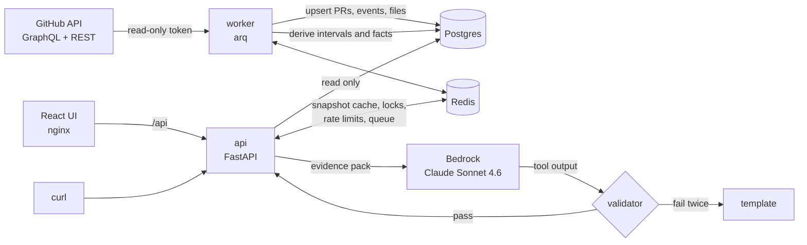

# 11 README and submission notes

## 1. Requirements

- Root README.md in **English**, written for reviewers reading it like a teammate's PR. Submission notes are a README section, not a separate file.
- 300–450 lines; prefer tables to long prose; lead each section with its conclusion.
- **No unverified numbers**: timings/sample sizes/results only from actual measurements. Without credentials/measurements use nonnumeric descriptions and list pending verification in final report.
- Commands match Makefile/Compose/.env.example; execute every command in M12.
- Assignment PDF requires trade-offs/deliberate omissions, **AI uses and workflow**, **one more day** priorities; public Git repository or zip/tarball with .git, PDF pages3–4; §7.5/§7.6/§9.

## 2. Section order

1. **Delivery Insights**: purpose, engineering manager/director audience, two endpoints in one paragraph.
2. **Quickstart (60 seconds)**: §3.
3. **The insight and why this metric**: §4.
4. **How it works**: Mermaid (§5), sync→derive→snapshot→narrative, component list api/worker/postgres/redis/web/migrate.
5. **API**: `06` §1 endpoint table; 3–4 curl examples from §8 (insight/304/snapshot/narrative);202/Retry-After/problem+json/ETag; link /docs.
6. **Narrative, confidence and evidence chain**: pack, four hypotheses with symptom/mechanism, formula/worked example (`07` §4.5), bands/wording, sentence-local numeric validator and causal-band limits, one repair/template/generated_by. State **deterministic evidence strength, uncalibrated on real data**, not probability (§7.1).
7. **Configuration**: user-relevant `02` §1 variables: GITHUB_TOKEN/AWS_BEARER_TOKEN_BEDROCK/AWS_REGION/BEDROCK_MODEL_ID/TRACKED_REPOS/LOCATION_DIMENSION/BACKFILL_DAYS/SYNC_INTERVAL_MINUTES/CI_SOURCE/CI_COMPLETE/CORS_ORIGINS/RATE_LIMIT_PER_MINUTE; fine-grained public-repository token, no extra permissions.
8. **Operations**: health/JSON log fields/repo status/manual sync/7-day snapshots/30-day jobs/rate limits/reset via docker compose down -v. Persistent202: inspect reason/job/status; rederive means version/config reprocessing, retried next cycle after failure. Template-only narratives: inspect fallback_reason.
9. **Security**:§6.
10. **Testing and evaluation**: why/what (`10` §1/§7); commands/latest measured make test/eval-offline after M12; real eval needs key.
11. **Submission notes**:
    1. Key trade-offs(§7.1)
    2. Things deliberately not done(§7.2)
    3. Beyond the brief(§7.3)
    4. Known limitations and next steps(§7.4)
    5. AI assistance (§7.5, required)
    6. With one more day (§7.6, required)
12. **Development**: make targets, one-level layout, docs/plan requirements, docs/DECISIONS implementation choices.

## 3. Quickstart template

````markdown
## Quickstart (60 seconds)

Prerequisites: Docker with Compose v2, and a GitHub fine-grained personal access token with
**Repository access: Public repositories** and no extra permissions.

```bash
cp .env.example .env          # set GITHUB_TOKEN; optionally AWS_BEARER_TOKEN_BEDROCK
docker compose up --build -d
open http://localhost:5173    # UI   (API docs: http://localhost:8000/docs)
```

The worker starts backfilling `dotnet/runtime` immediately (7 days first, then 30 and 180).
Until the requested period is covered the API answers `202 Accepted` with `Retry-After`,
and the UI shows sync progress.

```bash
TO=$(python3 -c 'import datetime as d; print(d.datetime.now(d.timezone.utc).date())')
FROM=$(python3 -c 'import datetime as d; print(d.datetime.now(d.timezone.utc).date() - d.timedelta(days=6))')
curl -s "http://localhost:8000/v1/insights/delivery?repo=dotnet/runtime&from=$FROM&to=$TO" | python3 -m json.tool | head -40
```

Without `AWS_BEARER_TOKEN_BEDROCK` everything works; the narrative endpoint uses a deterministic template
(`meta.generated_by: "template"`).
````

If M12 measures first-seven-day readiness, add actual time after the backfill sentence, e.g. "On our machine the first 7 days were ready after about N minutes." Otherwise omit timing.

## 4. "The insight and why this metric" (English draft; adjust to implementation)

> The core metric is **PR cycle time and who it is waiting on**: how long a change takes from its first commit to merge, and how much of that time is spent waiting on reviewers, on the author, on CI or to merge. The headline waiting share is measured against the whole cycle (coding plus post-ready time) as a proxy for flow efficiency; the time ledger then breaks down the post-ready part by who the PR is waiting on. Every response has two parts: **team efficiency** (the outcome: how fast, how stable, how much work was wasted, compared with the previous period) and **bottleneck analysis** (the cause: where the time goes, where it is stuck, why, and what to fix first, with a what-if estimate). The headline joins them in one sentence.
>
> Why this metric:
> - **It maps to decisions managers make.** Splitting cycle time by waiting state and by area turns every bottleneck into an action (add reviewers to an area, fix CI, change the approval policy) instead of "who wrote more code".
> - **GitHub has the richest signal for it.** The PR timeline records author, reviewer, CI and merge actions.
> - **It is an industry standard.** It corresponds to DORA's lead time for changes; the revert rate approximates the change failure rate.
> - **It is hard to game.** Waiting only shrinks when the process improves, and the revert rate is shown next to cycle time as a guardrail against buying speed with weaker review.

## 5. Architecture diagram (Mermaid)



## 6. Security section points

- Tokens are read only from environment variables (`SecretStr`) and are never logged; request headers and full upstream responses are not logged either. `.env` is git-ignored.
- Every input is validated against allow-list patterns; repositories must be in `TRACKED_REPOS`; the GitHub base URL comes only from configuration, so there is no SSRF path.
- SQL is always parameterized (SQLAlchemy).
- The LLM sees only numbers, evidence IDs, area names and repository names: no PR titles, bodies, comments or user names (prompt-injection defense); area names that don't match a strict pattern are replaced.
- Error responses are RFC 9457 problem details without stack traces or upstream messages.
- The UI renders all server text as plain text; links are limited to `https://github.com/`.
- Containers run as non-root users.

## 7. Submission notes (English draft)

### 7.1 Key trade-offs

| Decision | Choice | Cost | How we would change it |
|---|---|---|---|
| Time basis | UTC wall-clock hours; weekends and holidays count as waiting | PRs opened on a Friday look slower; "slow" may just be time-zone distance | Per-repo team time zone and holiday calendar; report business hours next to wall-clock hours |
| Multi-repo | `org=` and repeated `repo=` are supported, limited to tracked repos; the demo uses one repo | Aggregates hide per-repo differences; sync cost grows linearly; multi-repo scale is not demonstrated | `per_repo` is already returned; cap repos by activity and budget the sync quota |
| Aggregation | Pool PRs across repos before computing percentiles | Large repos dominate | Also return each repo's own percentiles |
| Bottleneck location | `area-*` labels first, then CODEOWNERS, then directories; configurable | Depends on labeling discipline; fallback granularity differs; labels are current, not historical | `meta.location_sources` shows the fallback share so teams can fix labels |
| Scope | Only PRs targeting the default branch; backports and bot PRs are excluded but counted | Release-branch waiting is invisible | Add a release-branch view |
| Freshness | Background sync to Postgres every 15 minutes; the API reads only local data | Up to one sync interval of lag; one more process to run | GitHub webhooks |
| Repo whitelist | Only `TRACKED_REPOS` are analyzed | Cannot analyze an arbitrary repo on the fly | Admin endpoint to manage the whitelist |
| LLM role | Narrative only; numbers and confidence come from code | May miss findings outside the evidence pack | Extend observations and the hypothesis library |
| Snapshot computation | Immutable snapshots keyed by parameters and data version, computed on demand without a lock | Two concurrent cold requests may compute the same snapshot twice | Single-flight lock if it ever matters |
| Rate limiting | Fixed window per client IP; requests through the bundled nginx share one bucket | Coarse | Per-user limits once there is authentication |
| Commit time | Commit events use the committer date; GitHub does not expose push time | Coding time and "commits after review" are approximations | Push events from webhooks |
| Reopened PRs | Time while a PR was closed (before being reopened) is not attributed to any waiting state | Cycle and stage times are milestone-to-milestone and still include that time, so they can exceed the ledger total for such PRs | Subtract closed periods from milestone durations if reopened PRs turn out to be common |
| CI data (demo repo) | Only GitHub Actions runs are collected; dotnet/runtime's main CI runs in Azure Pipelines and shows up as check runs, which this version does not collect | CI waiting is under-reported; CI hypotheses are capped at 0.5 confidence (`CI_COMPLETE=false`) | Collect check runs (the check-runs API works with the same fine-grained token on public repos) |
| Confidence calibration | Deterministic evidence-strength score, checked only on synthetic scenarios | The score is not a calibrated probability; real hit rates per band are unknown | Backtest thresholds on four quarters of history and calibrate the bands against a small hand-labeled set |

### 7.2 Things deliberately not done

| Not done | Why |
|---|---|
| Individual productivity metrics or leaderboards | Easy to game and harmful to trust; individuals appear only in the review-load distribution and the at-risk PR list |
| Calling GitHub on the request path | Requests read local data only: no quota burn, no slow requests |
| Letting the LLM compute numbers or rate its own confidence | Numbers and confidence are computed and validated in code |
| Sending PR titles, descriptions or comments to the LLM | Prompt-injection risk; the narrative does not need them |
| Business-hours calculation | Needs team time zones and holiday calendars (see trade-offs) |
| API authentication | Local demo service; production needs SSO and per-team authorization |
| Auto-discovering all repositories of an org | `org=` only aggregates the whitelist, so one request cannot trigger a huge sync |
| Webhook-based real-time updates | A 15-minute incremental sync is enough for weekly and quarterly views |
| A second data source | Only the `SourceAdapter` interface; the extension path is documented |
| P2 signals | Merge-to-release wait, impact of AI-authored PRs, dependency waits (stacked PRs, blocked labels), cumulative flow data, an extended hypothesis library |
| Chain-level delivery time | Superseded and revert/reland chains are linked, but cycle time is per PR; timing a chain from its first PR is a follow-up |
| Real-data backtest and confidence calibration | Needs historical replay plus hand labels; out of scope for this version (see trade-offs) |

### 7.3 Beyond the brief

List completed extras only: deterministic confidence/chains/validator/fallback; org multi-repo aggregation; immutable snapshots/ETags; PR drilldown; staged backfill/open sweep; director/manager×en/zh; eval; React; ownership parsing; Actions CI; drivers; KM/predictability; containers/CI workflow.

### 7.4 Known limitations and next steps

- GitHub sees only part of delivery: design discussions, communication and deployments outside GitHub are invisible, so cycle time approximates delivery time.
- Author dates can be rewritten, and rebased branches keep old author dates, which inflates coding time.
- Area labels and CODEOWNERS are read as they are now, not as they were when a PR was open.
- Teams listed as owners (for example `@dotnet/gc`) may have private membership, so owners are counted as teams.
- Small samples: percentiles need at least 20 (p50) or 30 (p90) PRs and rates need 30 cases with 5 events; below that the API returns `insufficient_sample` instead of a misleading number.
- Thresholds and confidence weights are initial, explained values (see `docs/plan/05-analytics.md` §1 and `07-narrative.md` §4); they have not been backtested on real data yet.
- To verify after the first sync of dotnet/runtime: human review coverage, bot PR share, and the share of PRs with an area label (`meta.location_sources`).

### 7.5 AI assistance (agent draft, submitter finalizes)

Be truthful. Agent writes only confirmed facts: its tool/model, authored components, executed checks/results, unperformed checks. Human actions remain <confirm: …> for submitter to fill/delete; never invent human review/decisions. List placeholders in final pending-human section (`12` G4).

```markdown
### AI assistance

- **Tools:** <confirm: tools used for the design document and the implementation plan, e.g. "Claude (Anthropic) in Cowork">; <agent: the coding agent and model that implemented the code> for most of the implementation, driven by `AGENTS.md` and `docs/plan/`.
- **What AI did:** <agent: e.g. "wrote most of the code, the tests and this README from the plan">. <confirm: what AI did for the design and the plan>.
- **What I did:** <confirm: decisions you made and what you reviewed, e.g. the metric, the demo repo, the trade-offs, plan reviews, diff reviews>.
- **How the output was checked:** <agent: the commands actually run and their results, e.g. make test, make eval-offline, invariant check, PR spot checks with PR numbers>.
- **Not verified:** <agent: anything that was not run, e.g. the Bedrock eval without credentials>.
```

### 7.6 With one more day (English; actual priorities, at most five)

```markdown
### With one more day

1. Backtest the at-risk and significance thresholds on four quarters of dotnet/runtime history, and calibrate the confidence bands against a small hand-labeled set.
2. Collect Azure Pipelines check runs so CI waiting and the CI hypothesis are complete.
3. Time superseded and revert/reland chains from their first PR.
4. Add an optional business-hours mode per repository.
```

In M12 remove completed items, add actual remaining priorities, sort by impact.

## 8. `docs/DECISIONS.md` format

```markdown
# Decisions

Deviations from `docs/plan/` made during implementation.

| Date | Topic | Decision | Reason |
|---|---|---|---|
| 2026-10-05 | Snapshot computation lock | No lock; duplicate cold computations are deduplicated by `ON CONFLICT` | Simpler; computation is deterministic and takes seconds |
```

One row per decision: what/why, not chronology. Example is a planned trade-off suitable as first entry. Also record uncalibrated real-data confidence/thresholds (`08` §5) and chain timing (`05` §4.5).

## 9. Submission format (PDF pages 3–4)

Choose public Git repository or zip/tarball containing .git. M12 only **prepares/checks**; human creates remote, pushes, uploads/sends (`AGENTS.md` §6/§8):

- Empty git status --porcelain; commit per milestone; no history secrets (`12` D1).
- Archive a fresh local clone: committed files and full .git only, no ignored .env/node_modules/.venv/dist/reports. Run below at repo root. Absolute or freshly resolved root paths; clone operations explicitly -C /tmp/di-submission/delivery-insights, no variables/cd; safe for original repository even when executed individually in new shells:

  ```bash
  bash -eu <<'SH'
  rm -rf /tmp/di-submission
  git clone --quiet --no-hardlinks "$(git rev-parse --show-toplevel)" /tmp/di-submission/delivery-insights
  git -C /tmp/di-submission/delivery-insights remote remove origin               # Remove local-path remote
  git -C /tmp/di-submission/delivery-insights reflog expire --expire=now --all   # Remove local-path clone reflog
  git -C /tmp/di-submission/delivery-insights gc --prune=now --quiet
  tar -C /tmp/di-submission -czf "$(git rev-parse --show-toplevel)/../delivery-insights.tar.gz" delivery-insights
  tar -tzf "$(git rev-parse --show-toplevel)/../delivery-insights.tar.gz" | grep '^delivery-insights/.git/HEAD$' >/dev/null && echo "has .git"
  tar -tzf "$(git rev-parse --show-toplevel)/../delivery-insights.tar.gz" | grep -E '(^|/)\.env$|/node_modules/|/\.venv/' && echo "local files found" || echo "no local files"
  grep -rqF "$(git rev-parse --show-toplevel)" /tmp/di-submission/delivery-insights/.git && echo "local path found" || echo "no local path"
  realpath "$(git rev-parse --show-toplevel)/../delivery-insights.tar.gz"
  SH
  ```

  Checks print has .git / no local files / no local path; final line absolute archive path in parent directory, included in final report. Do not use git archive (omits .git). Packaging is M12's **last step** after other checks and committed finalized README/DECISIONS; repackage after later commits.
- Public repo: human creates/pushes remote; verify unauthenticated git ls-remote <url> afterward.
- After human fills/commits README <confirm: …>, repackage (or push) so submission includes finalized disclosure.
